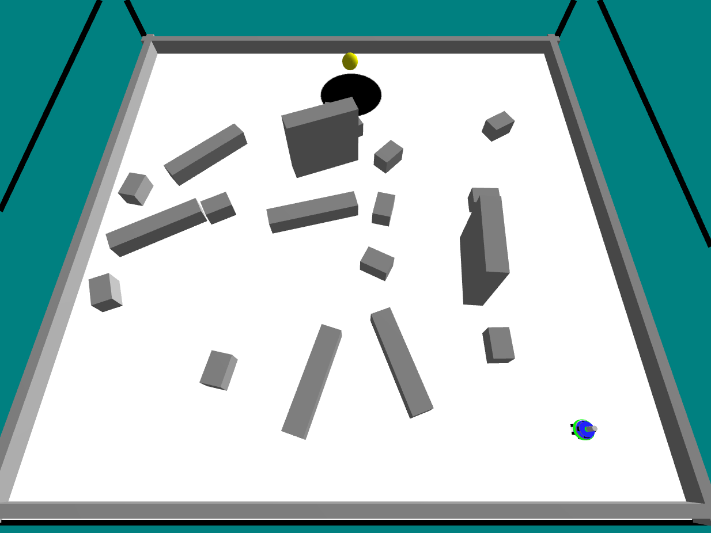

Laboratorio 3 — Controllo Subsumption

Descrizione
Questo laboratorio esplora un'architettura di controllo basata su subsumption per robot/simulazioni. L'obiettivo è implementare e testare comportamenti gerarchici che permettano al robot di prendere decisioni in tempo reale combinando moduli semplici.

Obiettivi
- Capire il modello subsumption per il controllo reattivo.
- Implementare il controller in `controller-subsumption.lua`.
- Eseguire la simulazione definita in `test-subs.argos` e analizzare i risultati in `doc/report.txt`.

Struttura del progetto
- `controller-subsumption.lua`: implementazione del controller basato su subsumption.
- `test-subs.argos`: file di configurazione della simulazione (scenario, robot, controller).
- `doc/report.txt`: report con osservazioni, risultati e commenti del laboratorio.

Requisiti
- ARGoS (simulatore) installato e disponibile nel PATH.
- Lua (se richiesto dal controller) e dipendenze tipiche del progetto.

Esecuzione (esempio)
1. Aprire una shell nella cartella del progetto.
2. Avviare la simulazione con:

```
argos3 -c test-subs.argos
```

Inserimento immagine frame


